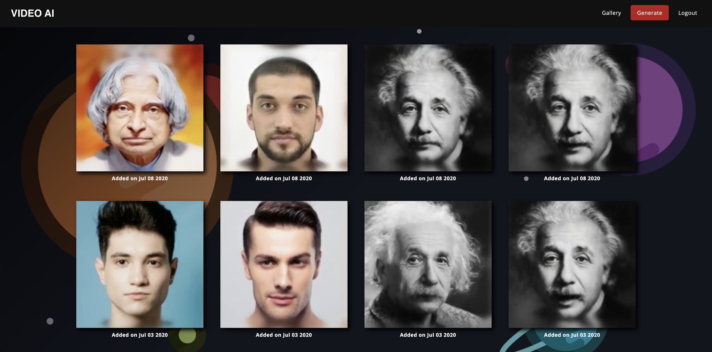
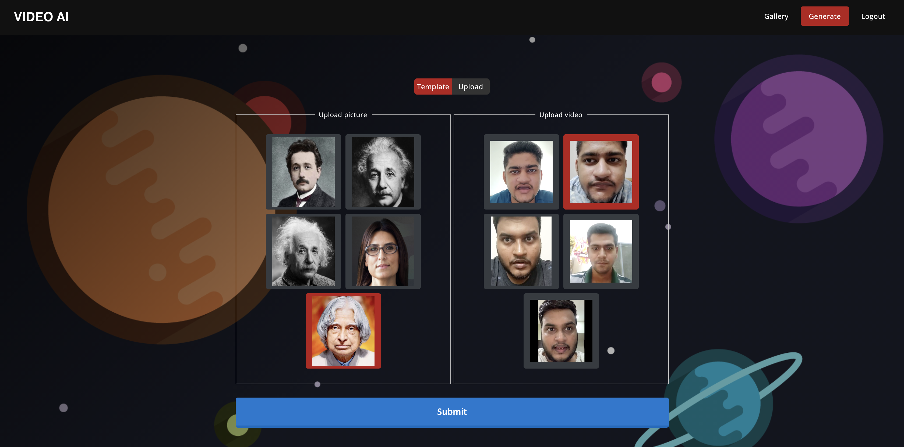
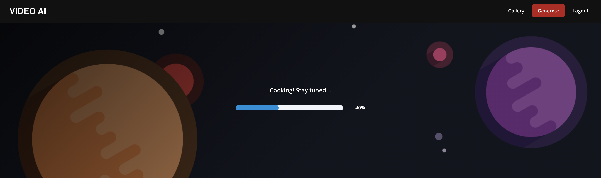

# VideoAI

A project inspired from [First-order Motion modeling](https://github.com/AliaksandrSiarohin/first-order-model).
Deals with taking in a video driver & image element and blending them to make a video-over-static-image overlap.

|  | <span style="font-size:2em;">+</span> | <span style="font-size:3em;">🔊</span> | =   |  |
| -------------------------------------------------------------- | ------------------------------------- | ------------------------------------- | --- | --------------------------------------------------------- |

-------------

## Results

Available in [samples](samples) directory.

## Installation

Project requires Python v3.8 or later. Use Python's package manager [pip](https://pip.pypa.io/en/stable/) to install dependencies.
```bash
pip install -r requirements.txt
```

## Usage

For development server, use the command:
```bash
python main.py
```
For production usage, the app can be run with `gunicorn` wsgi server:
```bash
gunicorn main:app
```
This project supports **Heroku** deployment (refer `./Procfile`)

## Demo

-   **Gallery**: Watch a list of videos already created

    


-   **Templates**: Use a template to try out the process

    


-   **Processing**: Takes a minute or two to complete processing on GPU backend and produce result

    
